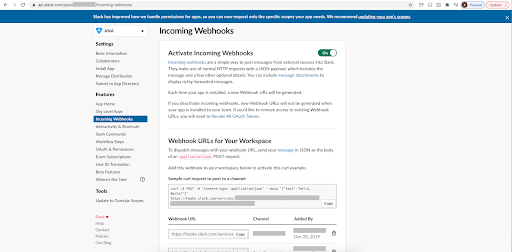
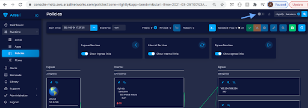
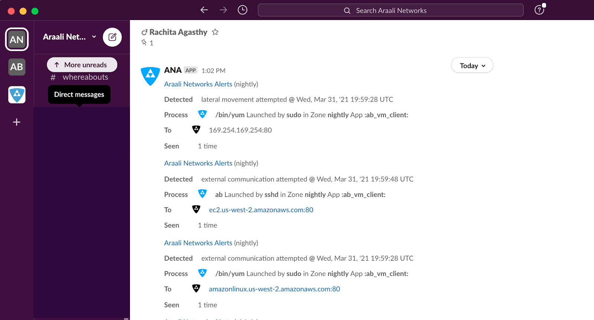

Getting Alerts in Slack
=======================
Araali supports multiple channels through which customers can access their
alerts. Slack is one of them. Slack alerts are sent using a webhook that can be
configured using Araali APIs.

Creating a slack webhook URL
----------------------------
`Here
<https://slack.com/help/articles/115005265063-Incoming-webhooks-for-Slack>`_ is
a link to help with creating slack webhooks. The steps are (please follow the
link for latest from slack directly):

1. Create a new Slack app in the workspace (araali - in the example below)
   where you want to post messages.
2. From the Features page, toggle Activate Incoming Webhooks on.
3. Click Add New Webhook to Workspace.
4. Pick a channel that the app will post to, then click Authorize.
5. Use your Incoming Webhook URL to post a message to Slack.

This is a sample slack application using which we show how to configure
webhooks for “araali” workspace. The webhook URL is created as part of the
application and we’ve chosen a slack channel on which we will receive
notifications.

Configure slack webhook URL
---------------------------
Once we have the webhook ready we can use araalictl api to configure the
webhook so that we can start receiving araali alerts on a slack channel::

        ./araalictl api -update-webhook -webhook <webhook_url>

Subscribing to Alerts
---------------------
We can subscribe to alerts for a lens we are interested in using araali UI as
below.

Finally, we should start receiving alerts on the slack channel that we configured.

