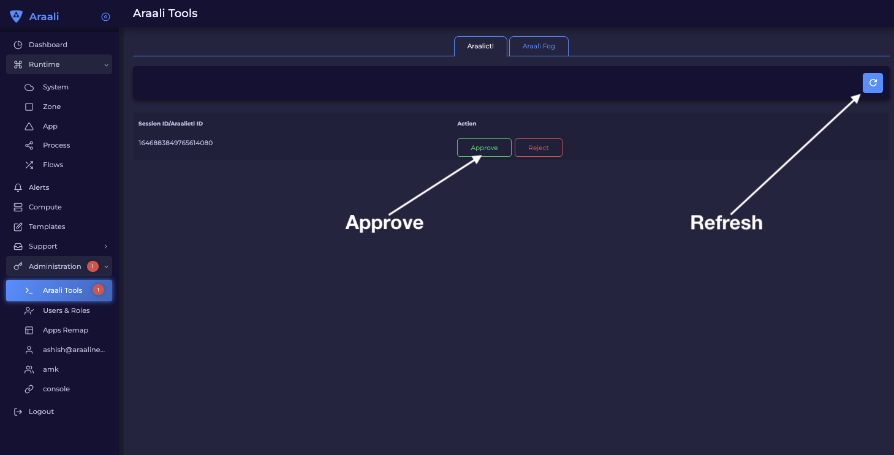
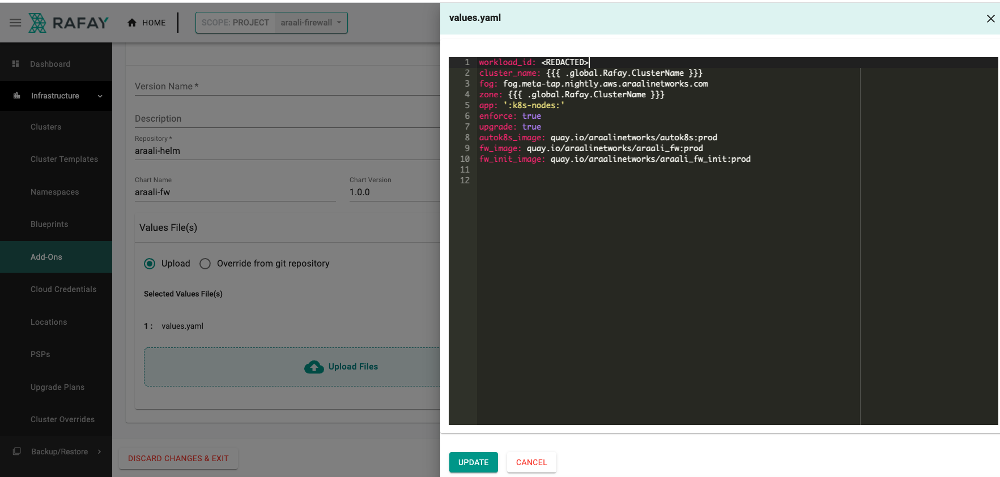

Getting Started with Rafay
==========================

Prerequisites
-------------
1. Registered with Rafay and account created
2. Register with Araali to create an account to:
    * Access the UI dashboard
    * Install `araalictl` and authorize it
    * Help with generation of Helm `values.yaml`

Araali UI Login
---------------
1. Open a chrome browser and go to [Araali Console](https://console.araalinetworks.com)
    
&nbsp;   

2. Click `Sign Up` to register
3. You are in!!
4. Now, in the left-hand panel, go to Administration and then Araali Tools. You will use this page to authorize Araalictl
    
   

Generating Helm `values.yaml`
-----------------------------
__Follow the steps below to generate a `values.yaml` file to use with Araali Helm chart for your cluster.__


### Setup

1. Download Araalictl 
   * On Linux
      ```console
      curl -O https://s3-us-west-2.amazonaws.com/araalinetworks.cf/araalictl.linux-amd64
      ```
   * On Mac
      ```console
      curl -O https://s3-us-west-2.amazonaws.com/araalinetworks.cf/araalictl.darwin-amd64
      ```
&nbsp;   

2. Make it executable
   ```console
   chmod +x araali*
   ln -sf araali* araalictl
   ```
3. Authorize araalictl
   ```console
   sudo ./araalictl authorize <email-id>
   ```
&nbsp;

4. Now go to Araali UI >> Administration >> Araali Tools to approve the araalictl session.
   


### Execution

1. Check if araalictl is installed
    ```console
    ./araalictl version -v
    ```
&nbsp;

2. Generate helm values::
    ```console
    ./araalictl fortify-k8s -out=helm > /tmp/values.yaml
    ```

Create Rafay Repository for Araali Helm chart access
----------------------------------------------------

Add Araali Helm repository to Rafay
- [Create Rafay Araali Helm Registry](https://console.rafay.dev/#/app/repositories)
  


*The Rafay repository will be used in the Araali addon below*

Create Rafay AddOn for Araali Firewall
--------------------------------------

Add Araali addon to Rafay 
- [Create Rafay Araali AddOn](https://console.rafay.dev/#/app/addons)

1. Click on `New AddOn`
   
&nbsp;

2. Click on `New Version`
   
&nbsp;   

3.
    Upload the previously created `values.yaml` file
    ```console
    Chart Name: araali-fw Chart Version: 1.0.0
    ```
&nbsp;
4. Edit the `values.yaml` in Rafay to get the runtime clustername from Rafay.
   
   
*The Rafay addon will be used in the Araali Blueprint below*

Create Rafay Blueprint that uses Rafay AddOn
--------------------------------------------

Add Araali blueprint to Rafay 
- [Create Rafay Araali Blueprint](https://console.rafay.dev/#/app/blueprints)

1. Click on `New AddOn`
   
&nbsp;

2. Click on `New Version`
   
&nbsp;

3. Use the addon created above in the add `AddOn` section

*This blueprint will be applied to the cluster*

Enable Rafay Blueprint on the cluster
-------------------------------------
Add Araali Blueprint to Rafay
- [Create Rafay Araali Blueprint](https://console.rafay.dev/#/app/blueprints>)

1. Click on the settings wheel icon and select ``Update Blueprint``
   
&nbsp;

2. Pick the Blueprint and Version created in previous step
   
&nbsp;
   
*Once the changes are saved, the Araali add on is __activated in the cluster__.
Check for the sync to finish and visit the Araali Dashboard for instant visibility into your cluster.*

Araali Dashboard
----------------

Go back to the Araali UI and click dashboard. You can see an inventory of your assets covered as well as detailed audits of your communication.


Uninstalling Araali
-------------------

Select the default blueprint and apply it to the cluster