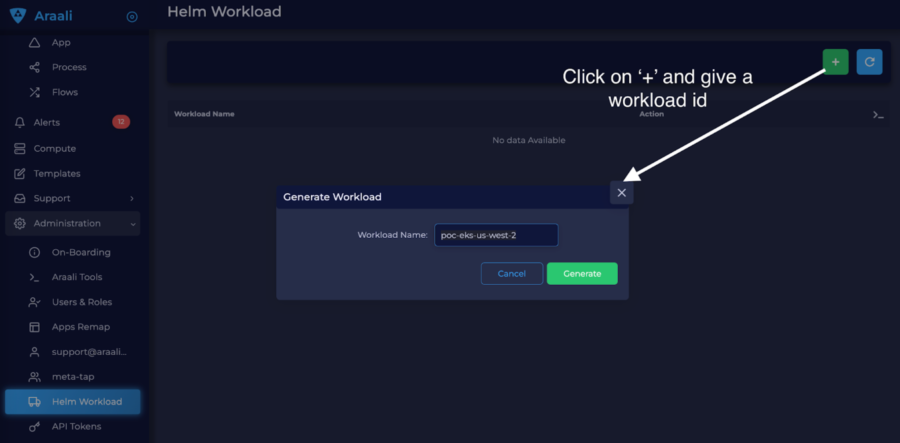

============
Installation
============

In this guide, we’ll walk you through how to install Araali software into your Kubernetes cluster or Linux VMs and secure your cloud native runtime.
We have made it easy for you to **single-click install as well as uninstall Araali.**

**Overview:** Installing Araali is simple. The first step is to self-serve onboard by creating an account on `Araali UI <https://console.araalinetworks.com>`_. 
After that, for K8s, helm install Araali software onto your Kubernetes cluster, run the Software you want to secure, and come back to the Araali UI for insights.

Steps for securing workloads running on Linux VMs are similar and described below.

**NOTE:** You should have outbound port 443 open for Araali to talk to its SaaS backend (normally it is already open).

Step 1: Sign In or Create a new Login using the Araali UI
*************************************************
NOTE: Your Araali account is automatically created on first login. If you want to be part
of another person’s (or, team’s shared) account, ask them to add you as a user in their
account before attempting to login.

Visit the `Araali Console <https://console.araalinetworks.com>`_ in your browser. If you have a Gmail or GSuite powered email, click the “Sign in with Google” button
to access the Araali UI with single sign on (SSO). There is no need to create a seperate Araali login.

If you do not have a Google powered email, use the “Sign up” button to create an Okta powered account using a non-google email. 

.. image:: images/araali-console-sign-in.png
    :width: 400
    :height: 800
    :alt: Araali Console Sign In

Step 2: Generate values.yaml for Installation
*********************************************

Go to Araali UI and select Administration -> “Cluster Fortification” in the left-hand panel.

Click on “+” and provide a name for your workload template. The generated values.yaml
can be used for both VMs and K8s clusters:

* To fortify multiple clusters the “zone” in the downloaded values.yaml must be changed per cluster (to represent the name of the cluster). For e.g. Kustomize can be used to automate multi-cluster deployments.

* To fortify VMs both zone and app must be changed prior to fortifying individual VMs.

Now download the file (example below) and save it as values.yaml file
::
    araali:
        workload_id: <wrk-id-variable>
        cluster_name: bar
        fog: foo
        zone: <name-you-specified>
        app: k8s-nodes
        enforce: true
        upgrade: true
        autok8s_image: quay.io/araalinetworks/autok8s:prod
        fw_image: quay.io/araalinetworks/araali_fw:prod
        fw_init_image: quay.io/araalinetworks/araali_fw_init:prod

Step 3A: Installation for Kubernetes
***********************************
**Add Araali Repo and Install the Helm Chart.**

1. Add Repo::

    helm repo add araali-helm https://araalinetworks.github.io/araali-helm/

2. Check if you are fortifying the right cluster by looking at the current context, the name with a “*” is the one you are pointing to right now:: 

    kubectl config get-contexts

3. Install by using the generated values.yaml file::

    helm install -f ./values.yaml my-araali-fw araali-helm/araali-fw

   Uninstall::

    helm uninstall my-araali-fw
    
Step 3B: Installation for VMs
****************************
**NOTE:** If you have already fortified your Kubernetes cluster, you do not need to additionally fortify your VMs.
These instructions are only for the non-Kubernetes case.

Cloud providers like AWS provide a hook to install software at the time of VM launch.
The generated values.yaml can be used in these init scripts to perform the VM install at boot.
The same approach also works on a live running VM (even without the init hook). It can also be used to embed into terraform.

We need to change the zone and app in values.yaml based on where (e.g. the zone could be changed to prod, staging, qa, or dev)  and
what app (e.g. redis, mongoDB, cassandra) will be running on the VM.

**Example: Install via AWS EC2 Instance UserData**
The following represents a way to embed araali software into an ec2 instance via UserData at bootup time.
Both values.yaml, and araalictl should be accessible to the ec2 instance. Embed this script into UserData::
    #!/bin/bash
    wget -q https://s3-us-west-2.amazonaws.com/araalinetworks.cf/araalictl.linux-amd64
    wget -q https://<resourceAccessUrl>/values.yaml # depending on where customer keeps this file
    chmod u+x araalictl.linux-amd64
    ./araalictl.linux-amd64 editvalues -zone=<zone> -app=<app> -f values.yaml
    sudo ./araalictl.linux-amd64 fortify-local -f values.yaml

On success, araalifw agent should be running on the VM, and providing functionality.
Any failure conditions are in general recorded in /var/log/cloud-init-output.log.

Review the Results
******************

| **Araali UI**
Go to the `Araali Console <https://console.araalinetworks.com>`_ and log in with the same email that was used to authorize araalictl.

.. image:: images/top_risk_buckets.png
  :width: 650
  :alt: Araali Dashboard Insights (Top Risk Buckets. Automatically Identified)

The Insights section on the Dashboard pull out nuggets of high priority information for you, such as:

* Database, DB-as-a-Service - your crown jewels
* World Exposed Process - check for accidental exposures
* Privilege Access Process and Containers - these have over privileges and can cause significant damage if exploited
* Critical Vulnerability Containers - these are running with critical CVEs
* SaaS Services - All the SaaS services consumed by your apps
* Log4j - to identify if you have any log4j vulnerability in your environment

You can click on any of the cards to review the details.

| **YAML File**
Access the assessment report using the following command
::

    ./araalictl assessment -report

Appendix
********

**If you are unable to use Helm for K8s fortification follow the below instructions**

**Requirements:** You should have access to a modern Kubernetes cluster and a functioning kubectl on your local machine.
If you don’t already have a Kubernetes cluster (e.g. EKS, GKE, AKS, RancherD), one easy option is to run one on your local machine. 
There are many ways to do this, including Canonical’s production-ready `microk8s for Ubuntu <https://www.araalinetworks.com/post/use-araali-with-microk8s>`_ .

You can validate you have a working setup by running
::

    kubectl version --short

You should see the output with both a Client Version and a Server Version component.

Fortify your cluster using Araalictl
^^^^^^^^^^^^^^^^^^^^^^^^^^^^^^^^^^^^
1. Check current context, the name with a "*" is the one you are pointing to right now::

    kubectl config get-contexts

2. Fortify your cluster

    * If araalictl and kubectl are running on the same machine::

        ./araalictl fortify-k8s -auto -tags=zone=<optional-zone-override> -context=<context of k8s cluster>
    * If araalictl and kubectl are not running on the same machine::

        # Create yaml file to fortify your cluster
        ./araalictl fortify-k8s -tags=zone=<optional-zone-override> -context=<context of k8s cluster>

        # The above command will generate araali_k8s.yaml file. Copy it to the k8s control plane (where kubectl is running) and then apply
        kubectl apply -f araali_k8s.yaml

3. Check if Araali is installed

    * Araali should be running in two namespaces (1) araali-operator and (2) kube-system::

        kubectl get pods -A

    .. image:: images/kubectl_post_install.png
      :width: 650
      :alt: Output of Kubectl after Araali Fortification

Uninstall Araali
^^^^^^^^^^^^^^^^^^^
If araalictl and kubectl are running on the same machine::

    ./araalictl fortify-k8s -delete -context=<context of k8s cluster>

If araalictl and kubectl are not running on the same machine::

    kubectl delete -f araali_k8s.yaml
 
VM Installation using Araalictl directly
****************************************
Araalictl is a command line tool that can also be used to fortify VMs.In the steps below 
we will first show how to download and authorize araalictl and then fortify a VM with it.

Step 1: Download Araalictl
**************************

If this is your first time running Araali, you will need to download the
“command-line tool” araalictl onto your local machine. You can either download
it from the Araali UI or curl it in.

**To download araalictl from the Araali UI**

Navigate to Download, under Support on the left-hand panel, and download the
araalictl for your Linux or Mac machine.

.. image:: https://publicimageproduct.s3-us-west-2.amazonaws.com/araalictldownload.png
  :width: 650
  :alt: Araalictl download from Araali UI

**To curl araalictl directly to your VM,** run::

   # On Linux
   curl -O https://s3-us-west-2.amazonaws.com/araalinetworks.cf/araalictl.linux-amd64

   # On Mac
   curl -O https://s3-us-west-2.amazonaws.com/araalinetworks.cf/araalictl.darwin-amd64

Step 2: Authorize your Araalictl
********************************
First, make your araalictl executable::

   chmod +x araali*

   ln -sf araali* araalictl

Authorize your session
::

   sudo ./araalictl authorize <CORRECT EMAIL ADDRESS>

**NOTE: To correctly authorize araalictl, please enter the same email that was used to sign into the Araali Console.**

.. image:: https://publicimageproduct.s3-us-west-2.amazonaws.com/AraalictlAuthorize.png
  :width: 900
  :height: 300
  :alt: Araalictl authorize

Now, go to Araali UI and Navigate to Araali Tools, under Administration on the
left-hand panel.

.. image:: https://publicimageproduct.s3-us-west-2.amazonaws.com/AraaliAuthn2.png
  :width: 600
  :alt: Araali Authorization

Click on the "refresh" button if you don't see "Approve" and click to approve araalictl. Also, the session-id listed on your araalictl will match the session-id shown in the UI.

The "Approve" button should go away and you will see the "Revoke" button which
could be used to revoke the araalictl

.. image:: https://publicimageproduct.s3-us-west-2.amazonaws.com/AraaliAuthn3.png
  :width: 600
  :alt: Araali Authorization

Step 3: Fortify your VM
***************************

Requirements
^^^^^^^^^^^^

1. **You should have a Virtual Machine already set up in order to fortify it with Araali.**
    * Alternatively, if you have a cluster of VMs and wish to fortify them all through a CM VM, see the :ref:`Remote Fortification` section.

2. You should have **port 443 egress open on all VMs** for Araali to talk to its SaaS backend.

Self Fortification
^^^^^^^^^^^^^^^^^^

1. Generate local ssh-keys (optional and only if you don’t already have id_rsa.pub in your ~/.ssh directory)
::
    ssh-keygen

2. Copy the public key to authorized_keys to allow passwordless local ssh access
::
    cat ~/.ssh/id_rsa.pub >> ~/.ssh/authorized_keys

3. If you don’t have passwordless sudo setup, edit the sudoers file as shown
::
    sudo visudo

4. Allow for password-less sudoers
::
    # Scroll to the very bottom of the file, add the following line
    # Replace <user> with the user for the VM
    <user> ALL=(ALL) NOPASSWD: ALL

    # ^X to save and exit editor

5. Self-Fortify
::
    ./araalictl fortify-live  -fortify -tags=zone=<zone_name>,app=<app_name> localhost

Remote Fortification
^^^^^^^^^^^^^^^^^^^^

1. Check Control VM

    * **A Control VM (CM VM) that has ssh access to the other VMs is used to remotely fortify from one place.**
        .. image:: images/remote_fortification_flow.png
          :width: 650
          :alt: Setup and Networking

    * It is important that araalictl is downloaded and authorized on the Control VM so that it can remotely install Araali on the rest of the VMs.
    * Remotely Fortify
    ::

        ./araalictl fortify-live -fortify -tags=zone=<zone_name>,app=<app_name> <remote_user>@<remote_host>

To update Zone and/or App tags of an already fortified VM
^^^^^^^^^^^^^^^^^^^^^^^^^^^^^^^^^^^^^^^^^^^^^^^^^^^^^^^^^^^
::

    ./araalictl fortify-live -add -tags=zone=<updated_zone>,app=<updated_app> <remote_user>@<remote_host>

**We recommend using your Configuration Management VM (Ansible, Salt, Puppet, Chef, etc.) as the control VM.**

Uninstall Araali
^^^^^^^^^^^^^^^^^^^
Self:
::

    ./araalictl fortify-live -unfortify localhost

Remote:
::

    ./araalictl fortify-live -unfortify <remote_user>@<remote_host>