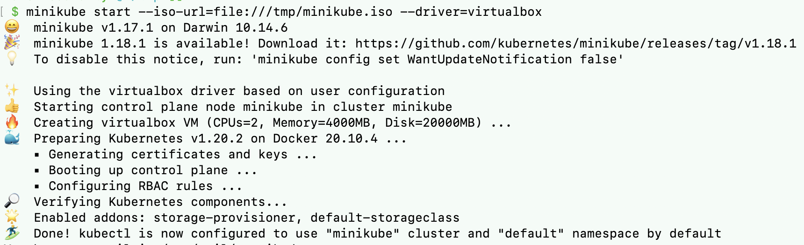
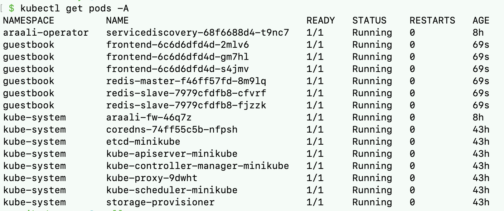

===================================
Getting started with minikube (Mac)
===================================

Minikube is a tool to setup a single node Kubernetes cluster. We will setup a single node cluster with the VirtualBox driver.

Install Minikube
****************

Install Minikube using Homebrew
"""""""""""""""""""""""""""""""

::

   /bin/bash -c "$(curl -fsSL https://raw.githubusercontent.com/Homebrew/install/master/install.sh)"

Once Homebrew is installed, you can proceed with Minikube

::

   brew install minikube

If ``which minikube`` fails you may have to remove the old minikube links and link the newly installed binary.

::

   brew unlink minikube
   brew link minikube

Install Minikube from binary
""""""""""""""""""""""""""""

For ``X86``::

   curl -LO https://storage.googleapis.com/minikube/releases/latest/minikube-darwin-amd64
   sudo install minikube-darwin-amd64 /usr/local/bin/minikube

For ``ARM``::

   curl -LO https://storage.googleapis.com/minikube/releases/latest/minikube-darwin-arm64
   sudo install minikube-darwin-arm64 /usr/local/bin/minikube

Install VirtualBox
******************

::

   brew install --cask virtualbox

Get the 4.19.94 based minikube.iso
**********************************

Get the iso from ``s3://araalinetworks.cf/minikube.iso`` to ``/tmp/minikube.iso``::

   curl -o /tmp/minikube.iso https://s3-us-west-2.amazonaws.com/araalinetworks.cf/minikube.iso

Start the Minikube Kubernetes cluster
*************************************

::

   minikube start --iso-url=file:///tmp/minikube.iso --driver=virtualbox

Check status

::

   minikube status

::

   kubectl get pods -A

Deploy an application
*********************

::

   kubectl create ns guestbook
   kubectl apply -n guestbook -f https://raw.githubusercontent.com/kubernetes/examples/master/guestbook/all-in-one/guestbook-all-in-one.yaml

Check the status

