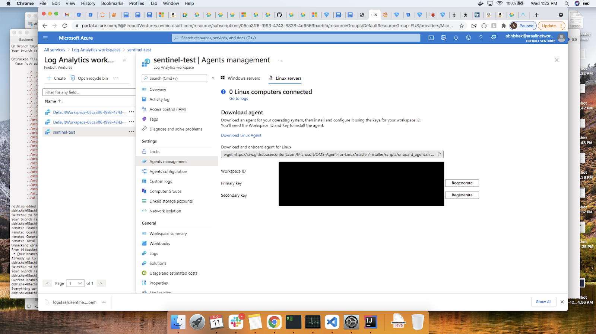

======================================
Getting Started with SIEM Integration
======================================

This is a guide on how to integrate Araali with supported SIEM products

Install Araali 
**************
Follow the instructions in the `getting started post <https://araali-networks-api.readthedocs.io/en/latest/gettingstarted.html#>`_

This sets up and authorizes Araalictl for local use.

Integration with ElasticStack
*****************************

Configure the TCP input plugin to accept json data. Open the existing LogStash config file
and add the following to the input plugin list.::

      input {
        tcp {
          port => 9099
          codec => "json"
        }
      }

Restart the LogStash service for the configuration to take effect.

   ``sudo systemctl restart logstash``

Check netstat to make sure LogStash has started listening on the chosen port.

   ``sudo netstat -lntp | grep 9099``

Start Araali Collector
**********************

Start the Araali Collector to submit Araali data to the configured LogStash TCP input port.

   ``./araalictl api -stream-start -stream-tcp=0.0.0.0:9099 -out=json -stream-cnt=1000``

Check status

   ``./araalictl api -stream-status``

Sentinel Integration
********************

Install logstash on a VM .::

    $ wget -qO - https://artifacts.elastic.co/GPG-KEY-elasticsearch | sudo apt-key add -
    $ sudo apt-get install apt-transport-https
    $ echo "deb https://artifacts.elastic.co/packages/7.x/apt stable main" | sudo tee -a /etc/apt/sources.list.d/elastic-7.x.list
    $ sudo apt-get update && sudo apt-get install logstash

Install Azure Sentinel Plugin for Logstash on the vm .::

    $ sudo /usr/share/logstash/bin/logstash-plugin install microsoft-logstash-output-azure-loganalytics

Figure out workspace id, primary key from Azure log analytics workspace settings as below

Add workspace key to logstash keystore and then create logstash config as below. Finally, restart logstash .::

    $ sudo mkdir -p /usr/share/logstash/config
    $ sudo /usr/share/logstash/bin/logstash-keystore create
    $ sudo /usr/share/logstash/bin/logstash-keystore add WS_KEY

    $ cat /etc/logstash/conf.d/araali_sentinel.conf
    input {
      tcp {
        port => 9099
        codec => json
      }
    }
    output {
      microsoft-logstash-output-azure-loganalytics {
        workspace_id => "<your_workspace_id>"
        workspace_key => "${WS_KEY}"
        custom_log_table_name => "araaliAlertsTable"
        plugin_flush_interval => 5
      }
    }

    $ sudo systemctl restart logstash.service

Now start araalictl stream to fetch alerts .::

    ./araalictl.linux-amd64 api -stream-start -stream-tcp=0.0.0.0:9099 -out=json -stream-cnt=100

Then we should be able to see the logs getting ingested under our workspace in azure sentinel > logs > tables tab

Useful links
------------
https://www.elastic.co/guide/en/logstash/current/installing-logstash.html
https://www.elastic.co/guide/en/logstash/7.14/running-logstash.html
https://docs.microsoft.com/en-us/azure/sentinel/connect-logstash
https://github.com/Azure/Azure-Sentinel/tree/master/DataConnectors/microsoft-logstash-output-azure-loganalytics
https://www.elastic.co/guide/en/logstash/current/working-with-plugins.html
https://www.elastic.co/guide/en/logstash/current/keystore.html
