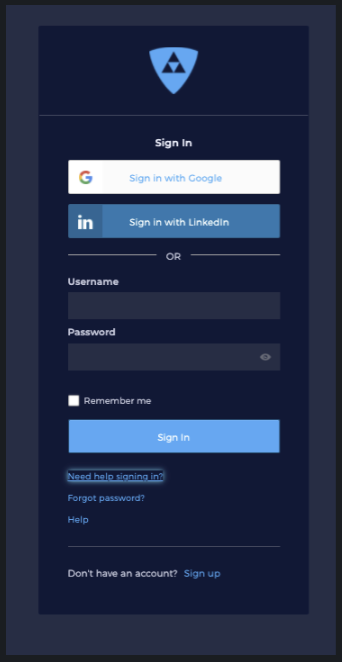
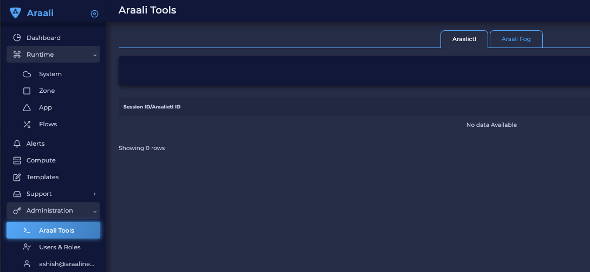
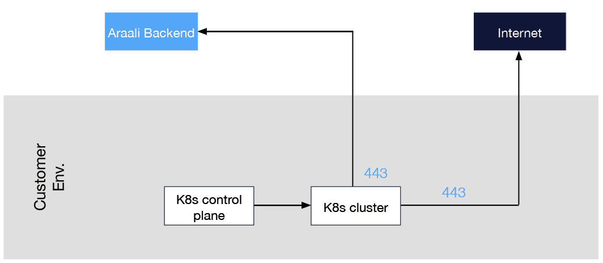
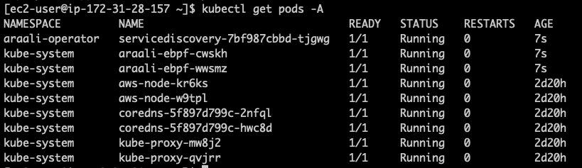
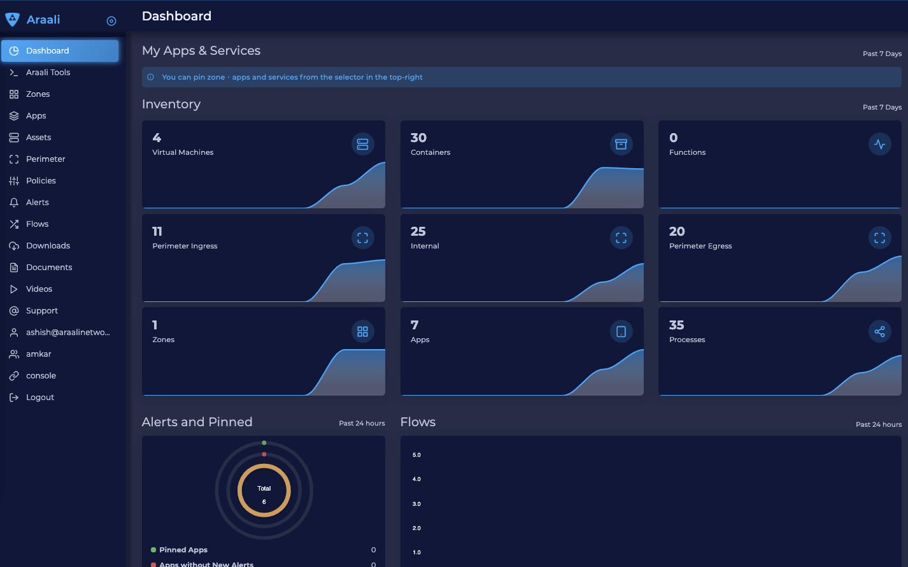

===============================
Getting Started with Kubernetes
===============================

Supported/Verified Managed Cloud K8s
************************************

1. AWS EKS - AmazonLinux (default) and Ubuntu node VMs
2. GCP GKE - CoS (default) and Ubuntu node VMs
3. Azure AKS - Ubuntu running default Kubernetes (v1.18) or later.
4. Canonical MicroK8s
5. RancherD

Prerequisites
*************
1. Cluster should have egress port 443 open to allow Araali to talk to the backend.

Araali UI Login
***************
1. Open a chrome browser and go to `Araali Console <https://console.araalinetworks.com>`_

2. If your email is already registered and your business email uses Google service, then use "Sign in with Google". Otherwise, click on “Need Help Signing In?” which will open “Forgot Password?”. Then, complete the steps to sign in to the console.
3. You are in!!
4. Now, in the left-hand panel, go to Administration and then Araali Tools. You have to come back to this page to authorize Araalictl

Fortifying a k8s Cluster
************************

Follow the steps below to fortify a Kubernetes cluster (same place where your k8s control plane is running).

1. Download Araalictl
    On Linux::

        curl -O https://s3-us-west-2.amazonaws.com/araalinetworks.cf/araalictl.linux-amd64

    On Mac::

        curl -O https://s3-us-west-2.amazonaws.com/araalinetworks.cf/araalictl.darwin-amd64

2. Make it executable::

    chmod +x araali*
    ln -sf araali* araalictl
3. Authorize araalictl::

    sudo ./araalictl authorize <email-id>

4. Now go to Araali UI >> Administration >> Araali Tools to approve the araalictl session.
5. Check if araalictl is installed::

    ./araalictl version -v

6. Check current context, the name with "*" is the one you are pointing to right now::

    kubectl config get-contexts

7. Fortify your cluster, araalictl and kubectl running on same machine::

    ./araalictl fortify-k8s -auto -context=<context of k8s cluster>

If araalictl and kubectl are not running on the same machine::

    # Create yaml file to fortify your cluster
    ./araalictl fortify-k8s -context=<context of k8s cluster>
    # The above command will generate araali_k8s.yaml file. Copy it to the k8s control plane (where kubectl is running) and then apply
    kubectl apply -f araali_k8s.yaml

Check if Araali is Installed
****************************

Araali should be running in two namespaces (1) araali-operator and (2)kube-system::

    kubectl get pods -A

Sample K8s Microservice to Test
*******************************
Google Cloud Platform eCommerce `Demo <https://github.com/GoogleCloudPlatform/microservices-demo>`_
Clone from Github::

    git clone https://github.com/GoogleCloudPlatform/microservices-demo.git

1. Create namespace or run it in default namespace::

    kubectl create ns gshop

2. run the microservice::

  cd microservices-demo/release
  kubectl apply -f kubernetes-manifests.yaml -n gshop

3. get URL of the frontend::

  kubectl get svc -A

Araali Dashboard
****************
Go back to the Araali UI and click dashboard. You can see an inventory of your assets covered as well as detailed audits of your communication.

To Uninstall Araali
*******************
To uninstall if araalictl and kubectl are on the same machine::

    ./araalictl fortify-k8s -delete -context=<context of k8s cluster>

Otherwise, delete the yaml file::

    kubectl delete -f araali_k8s.yaml
