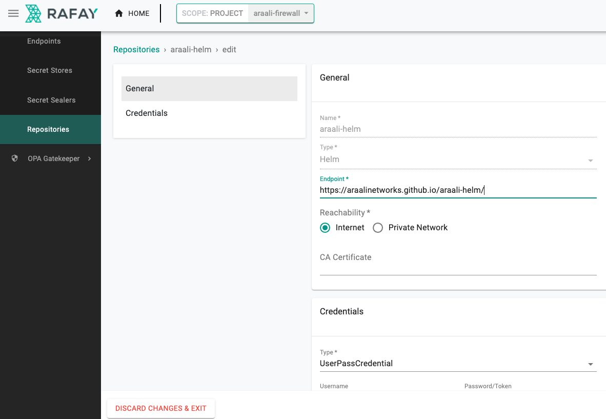
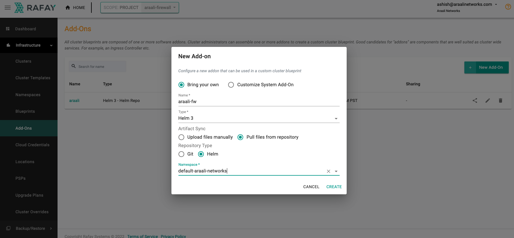
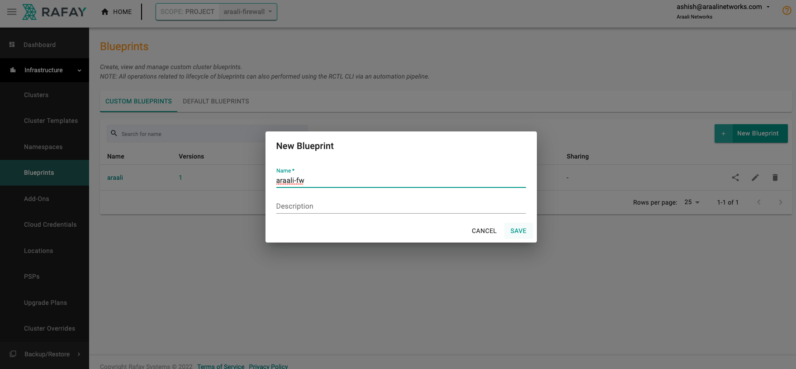
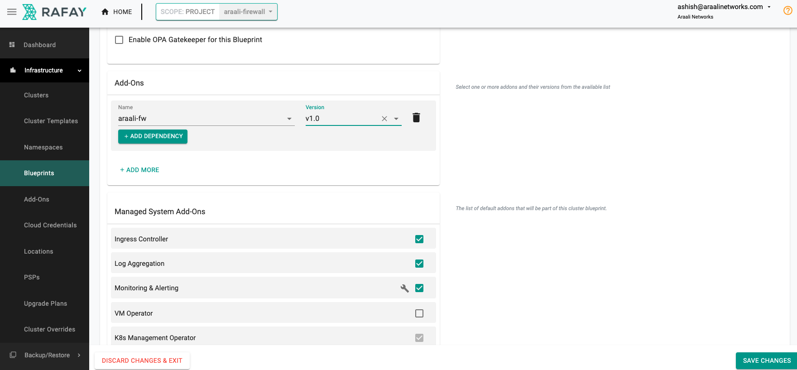
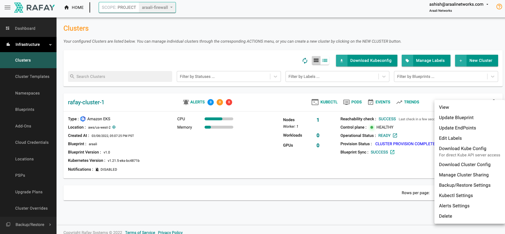
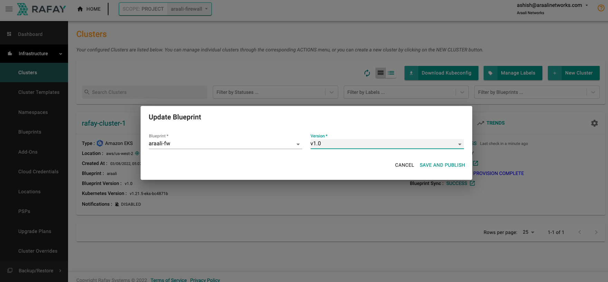

===============================
Getting Started with Rafay
===============================

Prerequisites
*************
1. Registered with Rafay and account created
2. Register with Araali to create an account
    * To access the UI dashboard
    * To install ``araalictl`` and authorize it
    * To help with generation of Helm ``values.yaml``

Araali UI Login
***************
1. Open a chrome browser and go to `Araali Console <https://console.araalinetworks.com>`_

.. image:: images/updated-araali-console-signin.png
 :width: 300
 :alt: Araali Sign-In

2. If your email is already registered and your business email uses Google service, then use "Sign in with Google". Otherwise, click on “Need Help Signing In?” which will open “Forgot Password?”. Then, complete the steps to sign in to the console.
3. You are in!!
4. Now, in the left-hand panel, go to Administration and then Araali Tools. You have to come back to this page to authorize Araalictl

.. image:: images/araali-auth-dash.png
 :width: 600
 :alt: Araali Authorization Dashboard

Generating Helm ``values.yaml``
*******************************
Follow the steps below to generate a ``values.yaml`` file to use with Araali Helm chart for 
your cluster.

1. Download Araalictl
    On Linux::

        curl -O https://s3-us-west-2.amazonaws.com/araalinetworks.cf/araalictl.linux-amd64

    On Mac::

        curl -O https://s3-us-west-2.amazonaws.com/araalinetworks.cf/araalictl.darwin-amd64

2. Make it executable::

    chmod +x araali*
    ln -sf araali* araalictl
3. Authorize araalictl::

    sudo ./araalictl authorize <email-id>

4. Now go to Araali UI >> Administration >> Araali Tools to approve the araalictl session.
5. Check if araalictl is installed::

    ./araalictl version -v

6. Generate helm values::

    ./araalictl fortify-k8s -out=helm > /tmp/values.yaml

Create Rafay Repository for Araali Helm chart access
****************************************************
Add Araali Helm repository to Rafay `Create Rafay Araali Helm Registery <https://console.rafay.dev/#/app/repositories>`_

The Rafay repository will be used in the Araali addon below

Create Rafay AddOn for Araali Firewall
**************************************
Add Araali addon to Rafay `Create Rafay Araali AddOn <https://console.rafay.dev/#/app/addons>`_

Click on ``New AddOn``

Click on ``New Version``

.. image:: images/rafay-araali-new-addon-version.png
 :width: 600
 :alt: Create Araali AddOn Version in Rafay

Upload the created ``values.yaml`` file::

    Chart Name: araali-fw Chart Version: 1.0.0

The Rafay addon will be used in the Araali Blueprint below

Create Rafay Blueprint that uses Rafay AddOn
********************************************
Add Araali blueprint to Rafay `Create Rafay Araali Blueprint <https://console.rafay.dev/#/app/blueprints>`_

Click on ``New AddOn``

Click on ``New Version``

Use the addon created above in the add ``AddOn`` section

This blueprint will be applied to the cluster

Enable Rafay Blueprint on the cluster
*************************************
Add Araali Blueprint to Rafay `Create Rafay Araali Blueprint <https://console.rafay.dev/#/app/blueprints>`_

Click on the settings wheel icon and select ``Update Blueprint``

Pick the Blueprint and Version created in previous step

Once the changes are saved the Araali add on is activated in the cluster.
Check for the sync to finish and visit the Araali Dashboard for instant visibility into your cluster.

Araali Dashboard
****************
Go back to the Araali UI and click dashboard. You can see an inventory of your assets covered as well as detailed audits of your communication.

.. image:: images/araali-dash.png
 :width: 600
 :alt: Araali Dashboard

To Uninstall Araali
*******************
Select the default blueprint and apply it to the cluster
