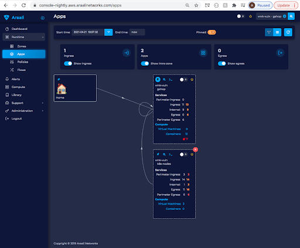
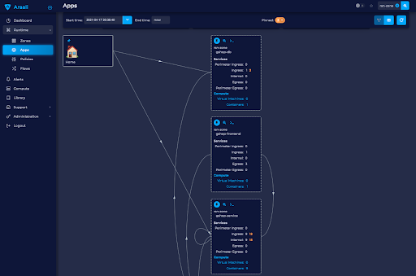

Remapping Apps
==============
Araali uses convention to discovers apps in your k8s environment. As best
practice, apps are deployed in their own namespace. There is no good reason to
actually not do so.

However, due to team isolation, sometimes namespaces are pre-created by the
infrastructure team and kept small by design (to prevent proliferation and also
to keep the privileges for namespace management limited to a smaller team).

For e.g. some people could have static namespaces that denote environments
instead of apps (prod, staging, dev). In other cases, namespaces could be
created per team for isolation (team1, team2). If teams map to features/apps,
then there is not much of an issue. However, a single team could be responsible
for multiple logical apps and the namespace itself ends up becoming a container
for these apps.

For such scenarios Araali allows you to customize apps the way you understand
it, regardless of which namespace they will show up in.

App mapping by example
----------------------
This is a sample google shop application where all the pods show up under a
single app - gshop. We’ll walk through the process of splitting this up into
three different apps.

List all the apps to pod mapping as a yaml file
~~~~~~~~~~~~~~~~~~~~~~~~~~~~~~~~~~~~~~~~~~~~~~~
::

        $ ./araalictl api -list-pod-mappings > pod_mapping.yaml

Update the mapping yaml file
~~~~~~~~~~~~~~~~~~~~~~~~~~~~
        i. We delete the pods we don’t want to remap.
        ii. As we can see we have the app and namespace set to the same value.
        iii. Now we reset the app to the name we would like to see it as.

This can be done programmatically as well. Here we show a manual way of editing
the yaml files.

Below is a sample yaml file generated. Now we would like to re-map the pods as
below.

        frontend → gshop-frontend

        redis-cart → gshop-db

        rest of the services → gshop-service

::

        $ vi pod_mapping.yaml
        - zone: prod
          namespace: gshop
          pod: checkoutservice
          app: gshop
        - zone: prod
          namespace: gshop
          pod: frontend
          app: gshop
        - zone: prod
          namespace: gshop
          pod: cartservice
          app: gshop
        - zone: prod
          namespace: gshop
          pod: recommendationservice
          app: gshop
        - zone: prod
          namespace: gshop
          pod: currencyservice
          app: gshop
        - zone: prod
          namespace: gshop
          pod: shippingservice
          app: gshop
        - zone: prod
          namespace: gshop
          pod: adservice
          app: gshop
        - zone: prod
          namespace: gshop
          pod: redis-cart
          app: gshop
        - zone: prod
          namespace: gshop
          pod: productcatalogservice
          app: gshop
        - zone: prod
          namespace: gshop
          pod: emailservice
          app: gshop
        - zone: prod
          namespace: gshop
          pod: paymentservice
          app: gshop

Edited yaml file (with changed app)::

        $ vi pod_mapping.yaml
        - zone: prod
          namespace: gshop
          pod: checkoutservice
          app: gshop-service
        - zone: prod
          namespace: gshop
          pod: frontend
          app: gshop-frontend
        - zone: prod
          namespace: gshop
          pod: cartservice
          app: gshop-service
        - zone: prod
          namespace: gshop
          pod: recommendationservice
          app: gshop-service
        - zone: prod
          namespace: gshop
          pod: currencyservice
          app: gshop-service
        - zone: prod
          namespace: gshop
          pod: shippingservice
          app: gshop-service
        - zone: prod
          namespace: gshop
          pod: adservice
          app: gshop-service
        - zone: prod
          namespace: gshop
          pod: redis-cart
          app: gshop-db
        - zone: prod
          namespace: gshop
          pod: productcatalogservice
          app: gshop-service
        - zone: prod
          namespace: gshop
          pod: emailservice
          app: gshop-service
        - zone: prod
          namespace: gshop
          pod: paymentservice
          app: gshop-service

Update the pod to app mapping in araali
~~~~~~~~~~~~~~~~~~~~~~~~~~~~~~~~~~~~~~~

::

        $ cat pod_mapping.yaml | ./araalictl api -update-pod-mappings

Once the above exercise is complete we can see that a single app before got
split into three different apps as below.

Programmatic mapping example
----------------------------
This can also be programmatically achieved using our python APIs. The
transformations should ideally be idempotent so they can be rerun without
issues::

        mapping = araalictl.get_pod_apps()

        if (obj["zone"] == "nightly-k8s" and 
            obj["namespace"] == "nightly-bend" and 
            "pod" in obj):

            if obj["pod"] in ["flowstitcher", "flowprocessor",
                              "assetinfo-processor",
                              'applens-generator', 
                              "applens-compactor", 
                              "vulnscanner"]:

                obj["app"] = "nightly-bend-pipeline"

        araalictl.push_pod_apps(mapping)

Functions
---------

Get
~~~

Get all Mapping content.

.. tabs::
   .. code-tab:: sh Command Line

        ./araalictl app-mapping -op list

   .. code-tab:: py

        api.Mapping.get()

Add
~~~~

Add to mapping content.

.. tabs::
   .. code-tab:: sh Command Line

        # "i" to insert at cursor, "a" for after cursor, and "o" for line above cursor
        vi add_mapping.txt
        # Insert zone, app, label in yaml format
        # Esc to exit edit mode in vi
        # “:wq” to quit once in control mode
        cat add_mapping.txt | ./araalictl app-mapping -op add

   .. code-tab:: py

        api.Mapping.add(zone, app, label)

Remove
~~~~~~

Remove from mapping content.

.. tabs::
   .. code-tab:: sh Command Line

        # "i" to insert at cursor, "a" for after cursor, and "o" for line above cursor
        vi add_mapping.txt
        # Insert zone, app, label in yaml format
        # Esc to exit edit mode in vi
        # “:wq” to quit once in control mode
        cat add_mapping.txt | ./araalictl app-mapping -op del

   .. code-tab:: py

        api.Mapping.rm(cls, zone, app, label)

App Remap Based on Pod Label Key
================================

If your pods already have a label that represents your desired app remap structure, then App Remapping can be easily accomplished via the UI.

Click and select “App Remap” and then click on the “+” icon on the top right corner.

.. image:: https://raw.githubusercontent.com/araalinetworks/attacks/main/images/appRemapButton.png
 :width: 600
 :alt: App remap

This will open “Add Pod Label” where you can select the zone/cluster, app/namespace that you want to remap. Pass the Pod Label Key for Araali to pull the information from the Pod metadata and remap your app.

.. image:: https://raw.githubusercontent.com/araalinetworks/attacks/main/images/addPodLabel.png
 :width: 600
 :alt: App Pod Label Key
