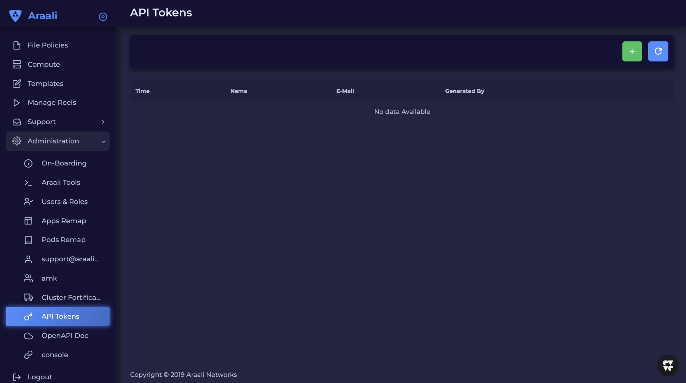
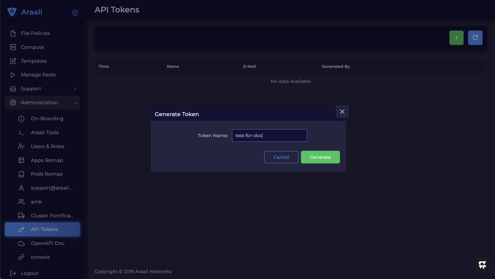
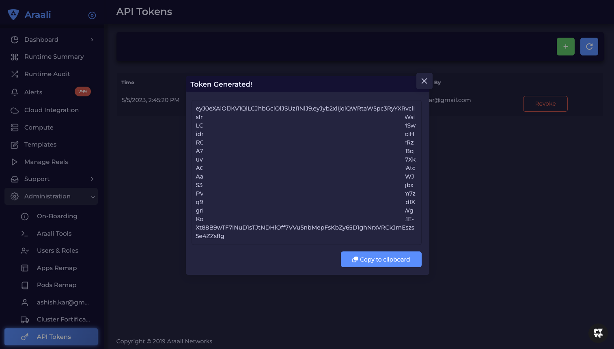
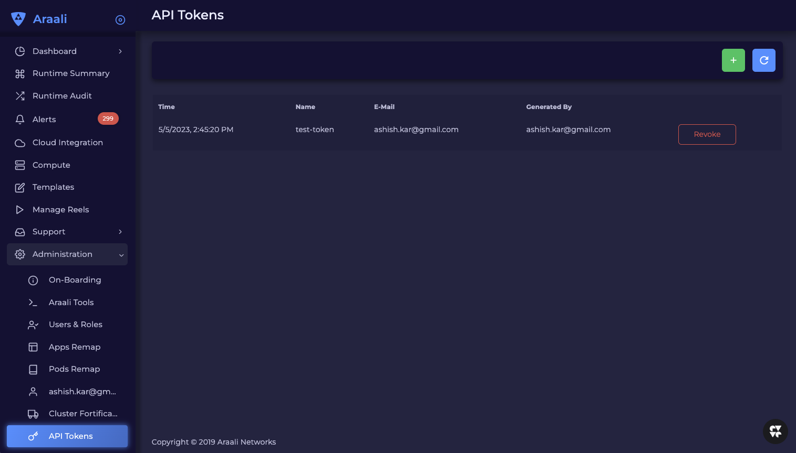

=========
REST APIs
=========

REST APIs are protected by tokens that need to be passed by the client making 
these requests.

To generate the token, go to Admininstration - API Tokens.

Click on + to create a new token.

Copy generated token and keep it in a safe store.

The token can be revoked at anytime.

Follow the API calls below to get specific information required for compliance
******************************************************************************

Assets
______

Lists out all the assets - VMs and containers, along with vulnerabilities. Also 
includes inactive assets that were previously live but are no longer running. ::

    https://api-prod.aws.araalinetworks.com/api/v2/listAssets?tenant.id=<tenant-id>&filter.time.start_time=2021-05-05T16:47:00.000Z&filter.time.end_time=2023-05-05T16:57:00.643Z&filter.list_active_vm=1&filter.list_active_container=1&filter.list_inactive_vm=1&filter.list_inactive_container=1

Enforced Lens
_____________

List of containers or VMs where Araali FW is enabled. This is to show that
 compensating controls and IPS exist for vulnerable containers. ::

    https://api-prod.aws.araalinetworks.com/api/v2/listShieldedLens?tenant.id=<tenant-id>

Alerts
______

List of open and closed alerts. This is to show that you have IDS enabled for
your cluster. ::

    https://api-prod.aws.araalinetworks.com/api/v2/listAlerts?tenant.id=<tenant-id>&filter.time.start_time=2023-05-03T16:57:00.643Z&filter.time.start_time=2023-05-05T16:57:00.643Z&filter.list_all_alerts=1&filter.open_alerts=1&filter.closed_alerts=1&filter.perimeter_egress=1&filter.perimeter_ingress=1&filter.home_non_araali_egress=1&filter.home_non_araali_ingress=1&filter.araali_to_araali=1&count=20

List Insights
_____________

This is the list of critical assets in your infrastructure like internet-exposed
assets, databases, high-privilege assets, potential backdoors, and many more. ::

    https://api-prod.aws.araalinetworks.com/api/v2/listInsights?tenant.id=<tenant-id>

