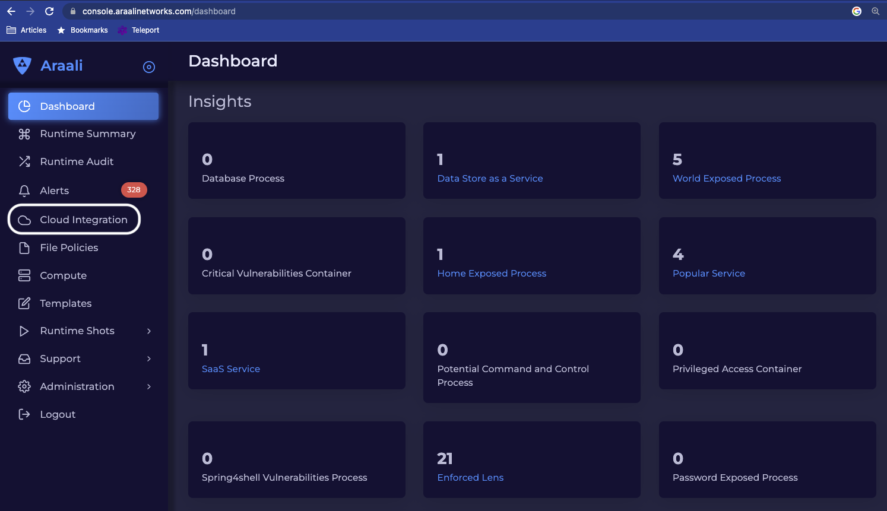
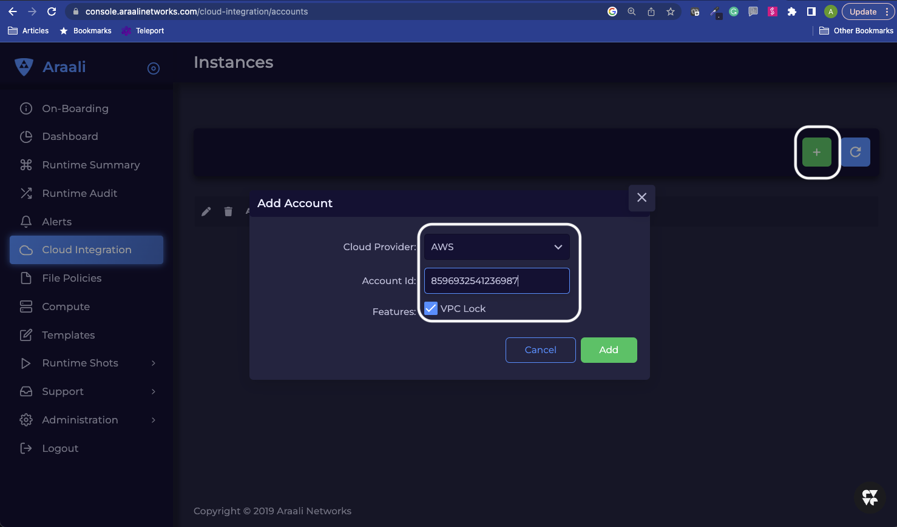
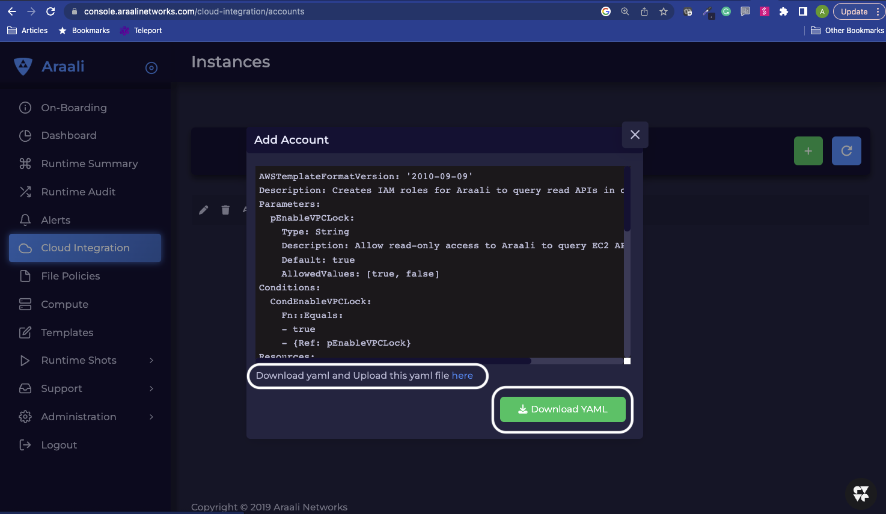
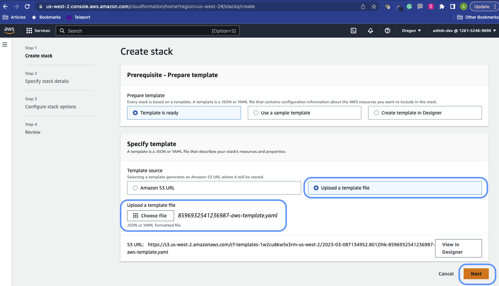
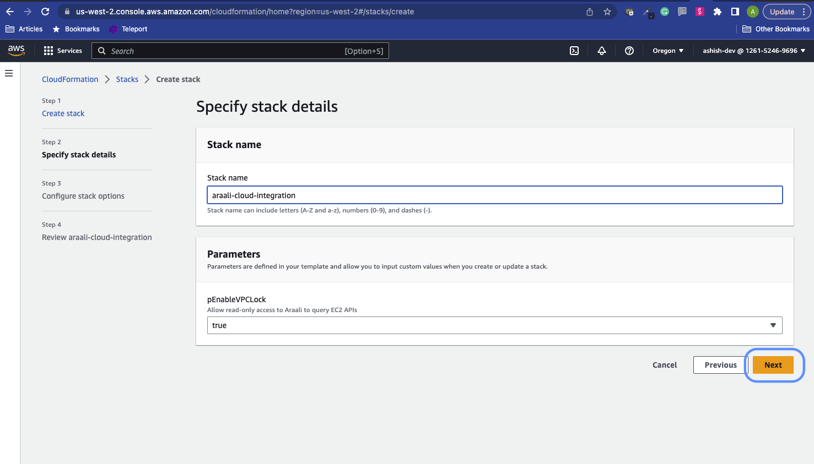
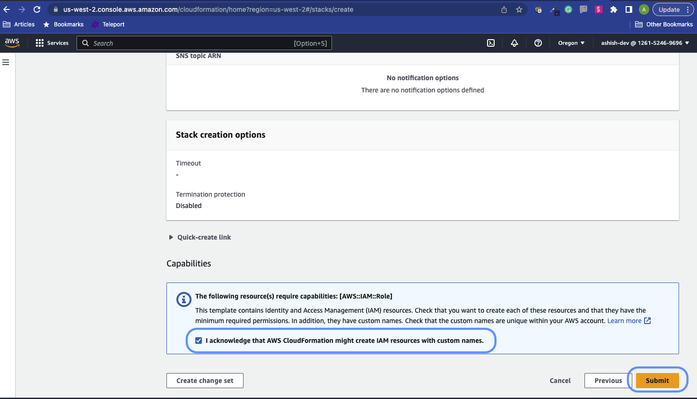
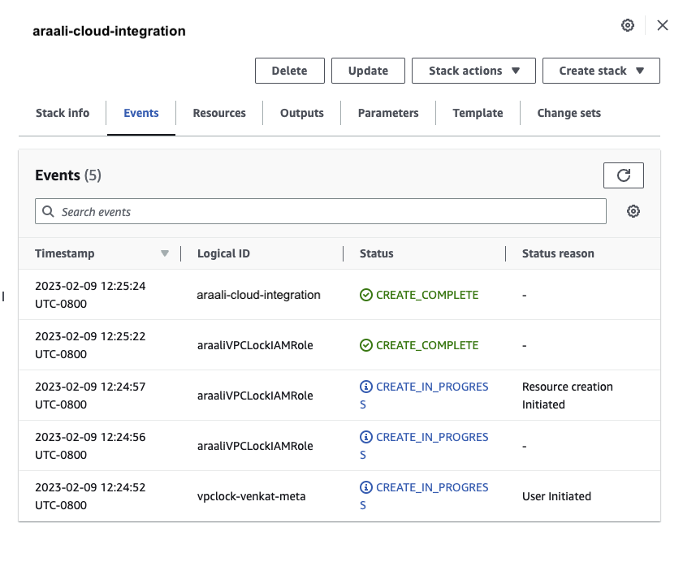
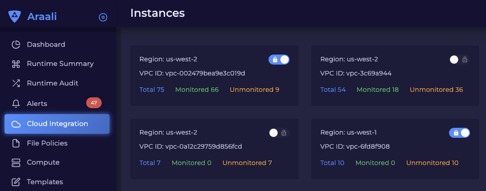

===================================
Setting up Araali Cloud Integration
===================================

1) In the Araali UI, go to “Cloud Integration” in the left-hand navigation 
panel.

2) Click the “+” icon on the top right, select your cloud provider, and enter 
your account id. Currently, Araali supports AWS only.

3) CLick on Download Yaml to download it on to your endpoint. Then click on 
“here” to open AWS cloud formation in another window to run this yaml file.

4) Upload the yaml file and go to next

5) Give a name to the stack. The rest of the default values are pre-populated,
click next to proceed.

6) Click next for Step 3 and finally acknowledge the IAM disclaimer and submit
for Stack Creation

7) Once the creation starts, go to the “Events” tab to check for completion

8) Go back to the Araali UI and now you will be able to see all the VPCs across
all regions here (could take about 60 mins when you run it for the first time).
It will list out the number of nodes in every VPC that is monitored and not 
monitored by Araali. You can turn on the lock to get an alert any time a node 
comes up without Araali on it.

